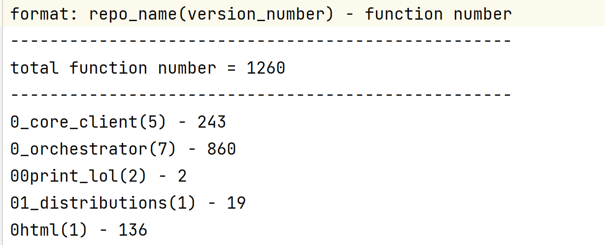
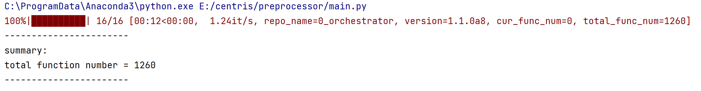
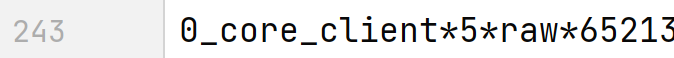
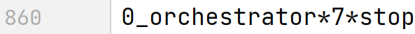
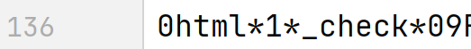
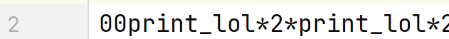
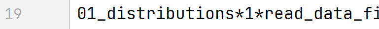
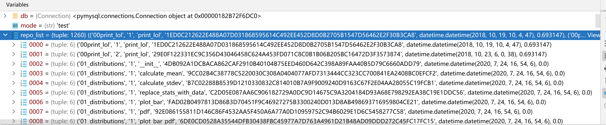
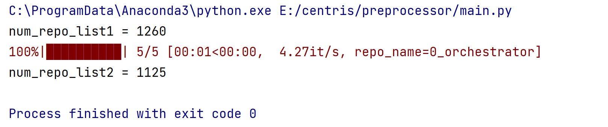
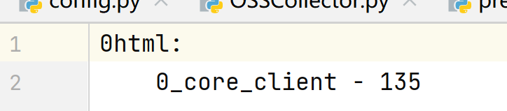

# CENTRIS
系统安全project


## collector

### 使用方法

编写配置文件，示例如config.

(new) 把文件整合到了`main.py`里，在Windows中直接`python main.py config`就可以了，Linux中使用`python3 main.py config` 

结果放在./cache中.
在collector文件夹下`./tar.sh`解压缩.

``Failed to request xxx''表示request失败，会被放进redo.log里。

Invalid package''表示包不存在或请求错误，不会重试。

### 注意事项

不能Ctrl-C中断，只能直接关掉命令行窗口或kill(QAQ).


在src目录下使用`tar.sh`对收集的pypi库文件进行重命名&解压

（linux下需要先`sudo apt install unzip`）

### 配置信息

repos_5000.txt	包含了top5000的项目

config_full.txt		包含了全部项目


## preprocessor

### 使用方法

运行main函数即可

==**注意事项：可以以小批量分批次运行，每次运行的时候，需要清空results文件夹，如果需要断点功能，要将continue_flag设为True，在运行一个批次的时候就不要动results文件夹和repo_info.txt文件了，等一个批次运行完毕之后，要保存这个批次运行得到的results文件夹和repo_info.txt文件，不然会被覆盖掉！！**==


### main

```python
if mode == "analyze":
	分析repo构建数据库，将信息保存在数据库中
elif mode == "analyze_file":
    分析repo构建数据库，将信息保存在文件中
elif mode == "segment":
    OSS去重，保留prime部分
elif mode == "test":
    可以用于查看数据库
```


### 文件

config里保存了全局参数

main文件为主程序


repo_func_summary.txt记录了每个repo的函数数量（仅在analyze模式生成，当需要从断点处继续分析的时候不会生成）

copy_summary.txt里面保存了OSS抄的哪些OSS


### 从断点处继续分析

如果需要从断点重新分析，需要将mode设为mode == "analyze_file"。

如果想重新分析所有的repo，可以将continue_flag设置为False

一般地，如果想继续分析，可以将continue_flag设置True


##### 用于构建数据库的文件

repo_info：保存了所有repo的信息

results：每一个repo一个文件夹，里面保存了repo中函数信息


### 数据库

##### repo表

repo_name CHAR(50),	项目名
version VARCHAR(40),	版本号
version_id INT,		版本id，从1开始计算
repo_date DATETIME	该版本的日期


##### func表

repo_name CHAR(50),		项目名
version_ids VARCHAR(200),	函数出现在的版本id集合
func_name VARCHAR(100),	函数名
hash_val CHAR(100),		函数哈希值
func_date DATETIME,		函数最初出现的时间
func_weight FLOAT		函数权重


### 测试

##### step1

在repo_test中，0html抄了0_core_client的代码















##### step2

将continue_flag = True

在repo_name=0_orchestrator时候停止

然后继续运行


##### step3

mode = "save_file"，然后mode = "test"，设断点调试，比较记录数量




##### step4

mode = "segment"



理论上来说列出的函数数量+后一次的函数数量=前一次的函数数量


